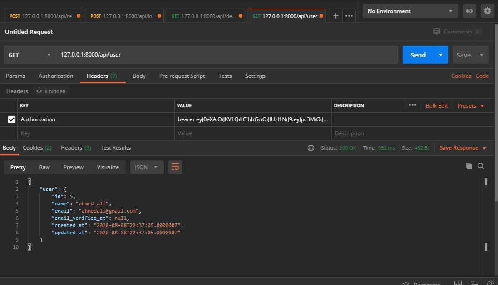
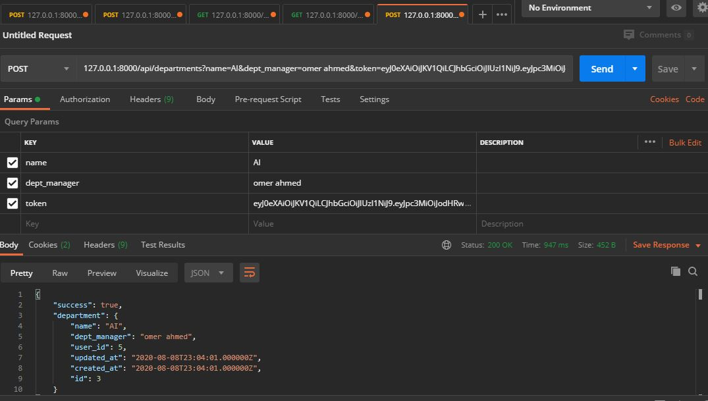
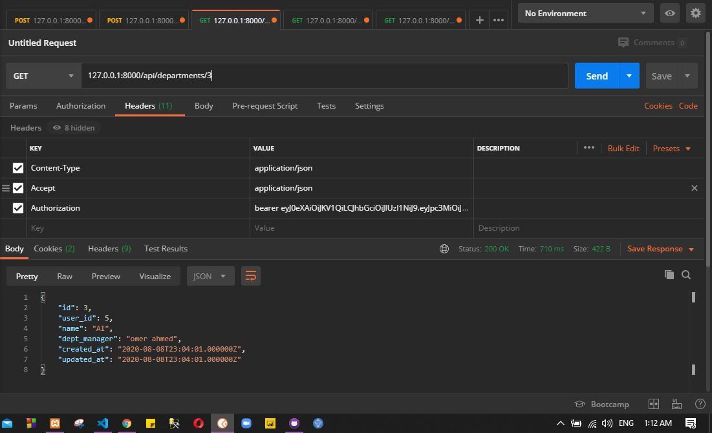
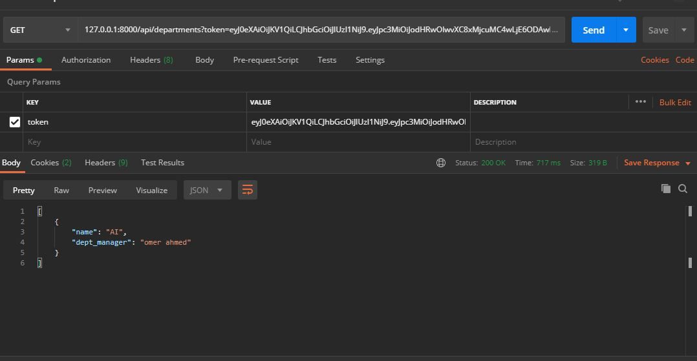
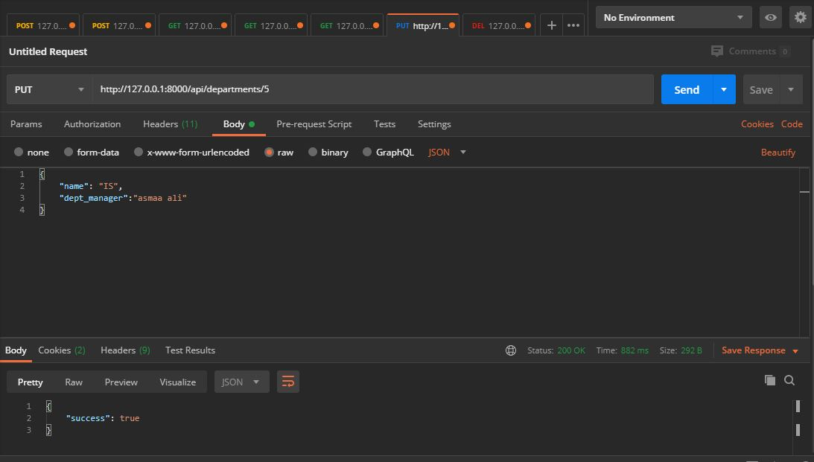
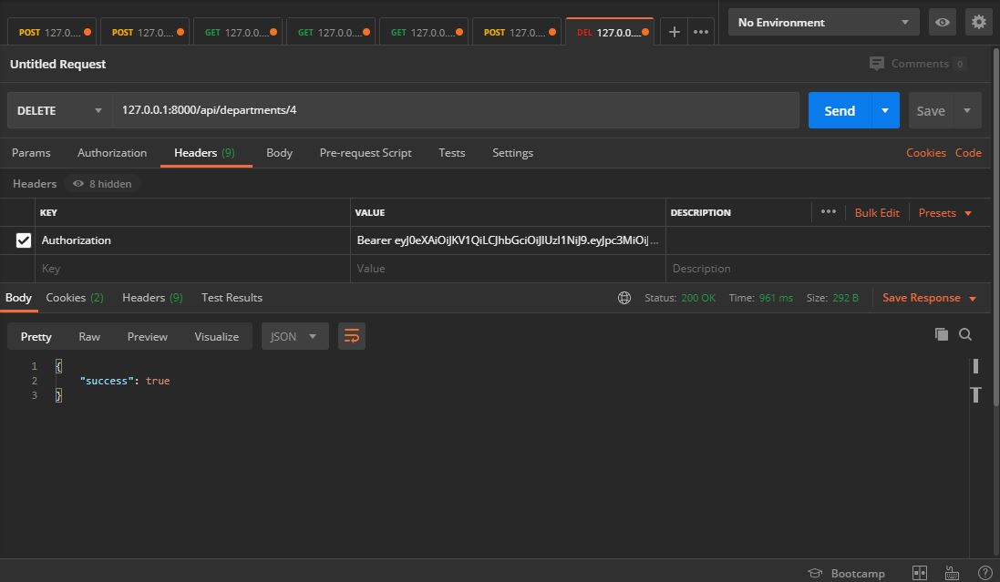

# laravel Task
PHP larevel Restful API for login and regitser + CRUD Operations
 

<h1>register api on postman</h1>
  
  <h1>login api on postman</h1>
  
   <h1>get user api on postman</h1>
  
   <h1>add department api on postman</h1>
  
  <h1>get department by ID api on postman</h1>
  
   <h1>get department by Token  api on postman</h1>
  
    <h1>get all department   api on postman</h1>
  
   <h1>update department   api on postman</h1>
  
   <h1>delete department   api on postman</h1>
  

